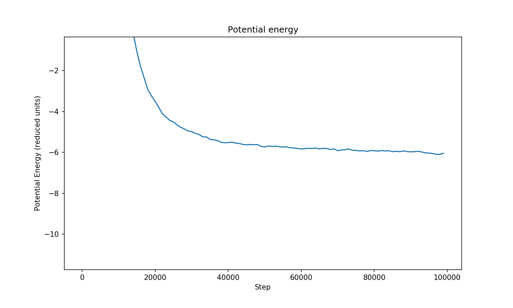

MolSSI Summer School 2019 MM Group #1 Project
==============================

A package for running monte carlo simulation. It works pretty well, in my opinion.

[//]: # (Badges)
[](https://travis-ci.org/MolSSI-Education/mm_2019_sss_1)
[](https://ci.appveyor.com/project/KirillShmilovich/mm-2019-sss-1/branch/master)
[](https://codecov.io/gh/MolSSI-Education/mm_2019_sss_1)

MolSSI Summer School Final Project.

## Dependencies

- Python 3.6+
- [NumPy](https://numpy.org)
- [matplotlib](https://matplotlib.org)

## Installation

With all the requirements above satisfied:
```bash
$ git clone https://github.com/MolSSI-Education/mm_2019_sss_1
$ cd mm_2019_sss_1
$ pip install .
```

## Usage

Initalize a `sim` object with `100` particles randomly initalized with a reduced density of `0.9`, a reduced temperature of `0.9`, a initial max displacement of `0.1`, and a cutoff of `3.0`:
```bash
$ import mm_2019_sss_1 as mm
$ sim = MC(method='random', 
           num_particles = 100, 
           reduced_den = 0.9, 
           reduced_temp = 0.9, 
           max_displacement = 0.1, 
           cutoff = 3.0)
```
Now use `run()` perform a simulation for 50,000 steps and printing metrics at a frequency of `freq`:

```bash
$ sim.run(n_steps=100000, freq=1000)
```

Optionally, the resultant energy can be plotted with:

```bash
$ sim.plot()
```

The plot this generates may look something like this:


### Authors 

Kirill Shmilovich (kirills@uchicago.edu)

Francesco Trozzi (ftrozzi@smu.edu)

Jazelli Mueterthies (jazellim@iastate.edu)

Yutao Ma (yma3@uchicago.edu)

Hanbo Hong (hhong11@ucmerced.edu)

### Copyright

Copyright (c) 2019, MM Group 1


#### Acknowledgements
 
Project based on the 
[Computational Molecular Science Python Cookiecutter](https://github.com/molssi/cookiecutter-cms) version 1.0.
